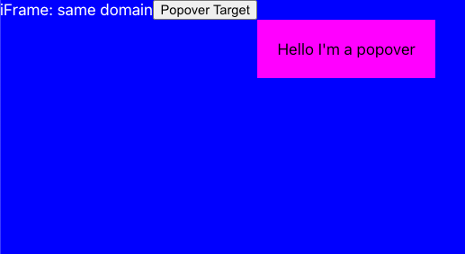
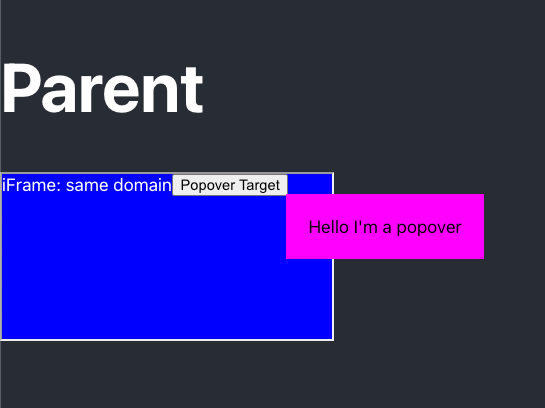

# Spike-iframe-floating-elements

## Start the app

### `npm start`

Runs the app in the development mode.\
Open [http://localhost:3000](http://localhost:3000) to view it in your browser.

The page will reload when you make changes.\
You may also see any lint errors in the console.

## The result

This branch looks at creating popovers that can work with and iframe - placing 
the popover element in the parent page so that the popover isn't limited and
restricted to the iframe. Its using React `createPortal` to do this.

### Caveats
- iframe must be the same domain/port to be able to access the parent DOM
  - attempting to access the parent window will result in errors otherwise
- The app in the iframe needs to be able to distinguish which frame it is in on the parent page
in order to be able to calculate the correctly calculate the offset so to position the 
popover correctly in relation to the popover target.

### Screens
The content when on its own page (not featured in a iframe) looks like this with the
pink element being an element positioned it relation to the Popover Target
viewable on

http://localhost:3000/frame

On this page, everything in the grey bordered area is the same page as the above. 
The popover is positioned correctly in relation to the Popover Target and is not 
constrained by the iframe 

http://localhost:3000

